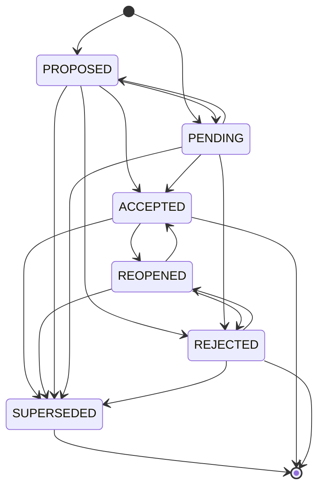
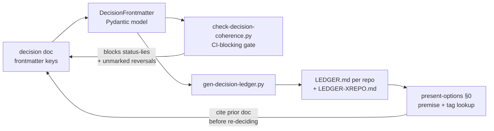

# Decision-doc classification model — the decision-memory schema

**Canonical doc.** This file is authored in sacred-patterns and **mirrored
verbatim into qiyas and bikar** (`<repo>/docs/decision-schema.md`) — the same
cross-repo pattern as `dsl-metadata-contract.md`. When a mirror disagrees with
this file, this file wins.

## Why this exists (plain English)

Across a five-week cascade the most expensive recurring mistake was *committing
to a decision before checking its premise*, and the second was *acting on a
decision record that lied about its own status*. A 2026-06-06 audit of 61
decision docs found **6 that said ACCEPTED in their header while their body said
"still pending owner review,"** **5 reversals where the overturned doc was never
marked superseded,** and **only 3 of 61 docs carrying any SUPERSEDED/REOPENED
marker** against at least 8 real reversals. A cold reader trusting a doc's
header would build on a decision the author themselves marked un-made.

This schema fixes that by giving every decision doc a small set of **structured,
machine-read frontmatter keys** — separate from the human-readable `status:`
prose — and a **typed model + state machine** that a generator and a checker
both consume. The header can no longer lie about the body, because the machine
reads only the structured keys and the rules compare *parsed fields*, never
regex over the prose.

The technical pieces this introduces: a Pydantic `DecisionFrontmatter` model
(in qiyas, where the mypy-strict gate lives), a generated `LEDGER.md` per repo,
and a CI-blocking `check-decision-coherence.py`.

## The two axes

A decision has two orthogonal axes. Conflating them is what produced the audit's
false positives (a PROPOSED doc *with* a recommendation was wrongly flagged as a
mismatch).

| Axis | Field | Values | Meaning |
|------|-------|--------|---------|
| **Lifecycle** | `status_token` | PROPOSED · ACCEPTED · REJECTED · SUPERSEDED · REOPENED · PENDING | Where the decision is in its life |
| **Decided** | `decided:` prose / `picked_option` | a date / option letter, or PENDING/null | Whether an owner has actually picked |

The load-bearing rule that ties them: **`status_token == ACCEPTED ⟹
picked_option is not null`.** A PROPOSED or PENDING doc may legitimately have
`picked_option: null` ("a recommendation exists, the owner hasn't picked") —
that is the benign state the audit's cluster pass over-flagged, now green by
construction.

## Status lifecycle — the state machine

`status_token` is a state machine, not a free enum. A doc cannot go
PROPOSED → SUPERSEDED *without an intervening ACCEPTED* if it was ever the live
decision — a reversal must pass through ACCEPTED/REOPENED so the record shows the
decision was once live. (A never-accepted proposal *may* be superseded directly
by a later doc on the same tag.) SUPERSEDED is terminal: reviving a decision is
a new doc, or REOPENED on the successor — never a backward edge.



## Structured frontmatter keys

The human `status:` and `decided:` prose lines stay (they carry nuance a reader
wants). Tools read **only** these dedicated keys:

```yaml
---
# --- human-readable (kept, never machine-parsed) ---
status: ACCEPTED 2026-06-01 — Option E (gate on geom_label); Option C falsified
decided: 2026-06-01 — Option E
owner: ACCEPTED 2026-06-01 (qiyas#669)
# --- machine-read structured keys (the contract) ---
status_token: ACCEPTED          # one of the StatusToken enum
picked_option: E                # option letter, or null
tag: face-class-identity        # member of docs/decisions/tags.yaml
supersedes:                     # doc-paths this reverses (forward chain)
  - docs/decisions/2026-05-28-f2-cross-construction-validation-scope.md
superseded_by: []               # doc-paths that reverse THIS (back chain)
dead_end:                       # optional; on SUPERSEDED/REOPENED/REJECTED docs
  approach: shape_id as retrieval label
  verdict: REFUTED              # DEAD | REFUTED | OPEN
  use_instead: geom_label (detector geometric type)
  prior_art: Kaplan 2005 (forward map is many-to-one)
---
```

### Key definitions

- **`status_token`** — exactly one of `PROPOSED | ACCEPTED | REJECTED |
  SUPERSEDED | REOPENED | PENDING`. A set-membership check on a parsed value.
- **`picked_option`** — the chosen option letter (e.g. `E`) or `null`.
  Invariant: `ACCEPTED ⟹ not null`.
- **`tag`** — kebab-case problem-tag from the closed `tags.yaml` vocabulary.
- **`supersedes` / `superseded_by`** — doc-path lists forming the reversal
  chain. Bidirectional: if B `supersedes` A, then A must `superseded_by` B and
  A's `status_token` must be SUPERSEDED or REOPENED.
- **`dead_end`** — optional block recording a falsified approach so a future
  session won't retry it. `verdict` is typed `DEAD | REFUTED | OPEN`:

  | verdict | meaning | prior-art example |
  |---------|---------|-------------------|
  | `DEAD` | confirmed-dead; use the replacement | girih hand-authoring → substitution-rule (Lu & Steinhardt 2007) |
  | `REFUTED` | the dead-end was wrong / solvable | derotation-by-shape-count → turning-function already solves it (Arkin 1991) |
  | `OPEN` | open-in-field; genuine engineering territory | raster-fold, clip-variants, the I2 photo cascade (Kaplan 2005: provably non-unique) |

## The dead-end verdict enum — meaning

The three verdicts match the 2026-06-06 prior-art report's own three-way
marking, so the LEDGER's dead-end column is typed, not free text. `DEAD` is a
confirmed dead-end with a known replacement; `REFUTED` means the *belief that it
was a dead-end* was itself wrong (the approach is solvable, usually by an
existing tool); `OPEN` means no published source resolves it either — it is
genuine engineering territory, not a solved-elsewhere oversight.

## Data flow — frontmatter to the premise check

The end-to-end mechanism: a decision doc's frontmatter is parsed into the typed
model, the model feeds both the gate (which blocks status-lies) and the
generator (which builds the LEDGER), and the LEDGER is what the next session
consults *before* re-deciding.



## The typed model

The structured keys are a **discriminated model, not a `dict[str, object]` bag**
(Tenet 15 — model variant data with types). The model lives in qiyas at
`src/qiyas/decisions/frontmatter.py` as `DecisionFrontmatter`; the generator and
checker import it instead of reading raw dicts, so the `ACCEPTED ⟹
picked_option` invariant is a model validator enforced once, not a use-site
check scattered across two tools.

```python
class DecisionFrontmatter(BaseModel):
    model_config = ConfigDict(frozen=True, extra="forbid")
    status_token: StatusToken          # Literal[PROPOSED, ACCEPTED, ...]
    picked_option: str | None = None
    tag: str
    supersedes: list[str] = []
    superseded_by: list[str] = []
    dead_end: DeadEnd | None = None
```

A worked example — the real F2 doc's C→E reversal frontmatter — lives in
`tests/test_decision_frontmatter.py::test_real_f2_doc_frontmatter_validates`
(the asymmetric witness: a genuine multi-state journey, not a happy-path stub).

## The coherence checker — five rules

`scripts/check-decision-coherence.py` reads **only** the structured keys (no
regex, no markdown-body scan). The rules, each tied to an audit finding:

1. **Status-token enum.** `status_token` must be in the enum. (Audit §2 —
   blesses/flags non-standard tokens like `RESOLVED-FREEZE-ACCEPT`.)
2. **Status↔decision agreement.** `ACCEPTED ⟹ picked_option is not null`.
   (Catches the 6 mismatches; structurally cannot produce the ~5 false
   positives.)
3. **Supersede-on-reversal.** If B `supersedes` A, then A is SUPERSEDED/REOPENED
   and `superseded_by` names B (bidirectional). (Attacks the 3/61 marker rate.)
4. **One-authoritative-doc-per-tag.** At most one doc per tag may be ACCEPTED
   with empty `superseded_by`. (Attacks the unmarked-reversal class.)
5. **Tag in vocabulary.** `tag` must be a member of `tags.yaml`.

A `.coherence-baseline.json` allowlist (per repo) grandfathers known violations
so the gate ships green; it is **append-blocked** (you can only shrink it).

## See also

- `docs/decisions/tags.yaml` (per repo) — the closed tag vocabulary, glossed.
- `docs/decisions/LEDGER.md` (per repo) — the generated "what's decided / dead /
  authoritative-per-tag" index.
- `src/qiyas/decisions/frontmatter.py` — the canonical typed model.
- `present-options` / `handle-falsification` skills — author docs with the keys
  and run the §0 premise check + dead_end backfill.
